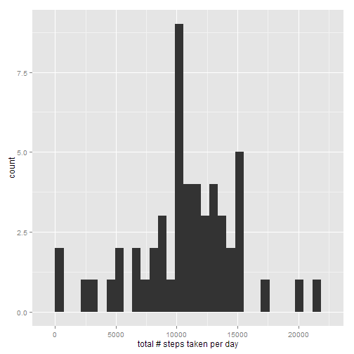
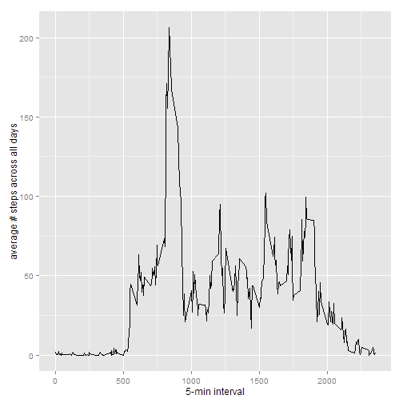
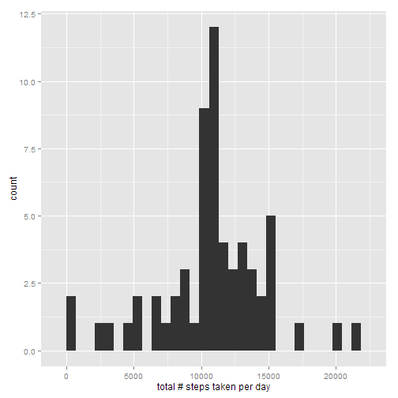
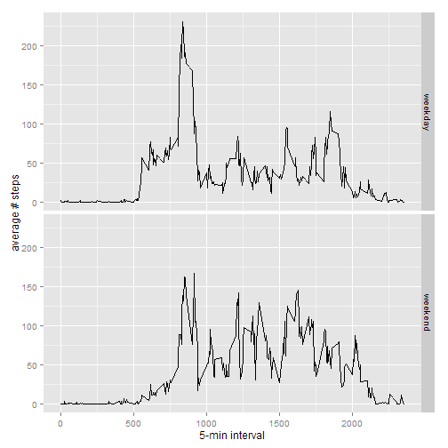

## Loading and preprocessing the data


```r
suppressMessages(library(lubridate, warn.conflicts = FALSE, quietly = TRUE_))
suppressMessages(library(ggplot2, warn.conflicts = FALSE, quietly = TRUE_))

data_file = "C:/classes/Coursera/Data_Science_Specialization/Reproducible_Research/project/RepData_PeerAssessment1/activity.csv"
data = read.csv(data_file)

# transform the date variable from factor to date type 
data$date = ymd(levels(data$date)[as.numeric(data$date)])
# transform the interval variable from numeric to factor 
data$interval = as.factor(data$interval)
```

## What is mean total number of steps taken per day?


```r
# calculate the total number of steps taken per day
aggregate_by_day =  aggregate(data$steps, by=list(data$date), FUN = sum)
names(aggregate_by_day) = c("date", "total_steps")
qplot(aggregate_by_day$total_steps, data = aggregate_by_day, geom = "histogram", xlab = "total # steps taken per day")
```

 

```r
mean_steps_per_day = mean(aggregate_by_day$total_steps, na.rm = TRUE)
median_steps_per_day = median(aggregate_by_day$total_steps, na.rm = TRUE)

mean_steps_per_day
```

```
## [1] 10766.19
```

```r
median_steps_per_day
```

```
## [1] 10765
```
The `mean` and `median` of the total number of steps taken per day are 10766.1887 and 10765, respectively.

## What is the average daily activity pattern?


```r
# compute the average # steps across days by interval
aggregate_by_interval = aggregate(data$steps, by=list(data$interval), FUN = mean, na.rm = TRUE)
names(aggregate_by_interval) = c("interval", "ave_steps")
qplot(as.numeric(levels(interval)), ave_steps, data = aggregate_by_interval, geom = "line", xlab="5-min interval", ylab="average # steps across all days")
```

 

```r
max_steps_interval = aggregate_by_interval[which.max(aggregate_by_interval$ave_steps), "interval"]

levels(aggregate_by_interval$interval)[as.numeric(max_steps_interval)]
```

```
## [1] "835"
```

The 5-minute interval, on average across all days, that contains the maximum number of steps is 835.


## Imputing missing values


```r
# total num of missing values in dataset
num_NAs = sum(is.na(data))
dates_with_NAs = unique(data$date[is.na(data)])
new_data = data
for (ii in 1:length(dates_with_NAs)) {
    print(paste(dates_with_NAs[ii], ":", sum(is.na(new_data[new_data$date == dates_with_NAs[ii], "steps"])), " NA's"))
}
```

```
## [1] "2012-10-01 : 288  NA's"
## [1] "2012-10-08 : 288  NA's"
## [1] "2012-11-01 : 288  NA's"
## [1] "2012-11-04 : 288  NA's"
## [1] "2012-11-09 : 288  NA's"
## [1] "2012-11-10 : 288  NA's"
## [1] "2012-11-14 : 288  NA's"
## [1] "2012-11-30 : 288  NA's"
```

```r
# replace the NA's
for (ii in 1:length(dates_with_NAs)) {
    new_data$steps[new_data$date == dates_with_NAs[ii]] = aggregate_by_interval$ave_steps
}

# check if there's any remaining NA
any(is.na(new_data))
```

```
## [1] FALSE
```

The are a total of 2304 missing values in the dataset, which occur in the following dates: 2012-10-01, 2012-10-08, 2012-11-01, 2012-11-04, 2012-11-09, 2012-11-10, 2012-11-14, 2012-11-30. I noticed that if there is any missing value for the day, there will be missing values for all the intervals of that day. So I proceeded with replacing the `steps` values for all the intervals with the mean of the respective 5-minute intervals for the dates above. I then verified that there is no NA in the newly created dataset, `new_data`.


```r
# calculate the total number of steps taken per day for the imputed dataset
aggregate_by_day_new =  aggregate(new_data$steps, by=list(new_data$date), FUN = sum)
names(aggregate_by_day_new) = c("date", "total_steps")
qplot(aggregate_by_day_new$total_steps, data = aggregate_by_day_new, geom = "histogram", xlab = "total # steps taken per day")
```

 

```r
mean_steps_per_day_new = mean(aggregate_by_day_new$total_steps, na.rm = TRUE)
median_steps_per_day_new = median(aggregate_by_day_new$total_steps, na.rm = TRUE)

mean_steps_per_day_new
```

```
## [1] 10766.19
```

```r
median_steps_per_day_new
```

```
## [1] 10766.19
```

The `mean` and `median` of the total number of steps taken per day for the imputed dataset are 10766.1887 and 10766.1887, respectively. Due to imputation by the mean, the `mean` value did not change, while the `median` value increases slightly by 1.1887. The imputation has some impact on the estimates of the total daily number of steps because there are 8 out of 61 days, or 13.1148% of the data, with missing values. Since they are replaced with the `mean` of respective 5-min intervals, the count of the histogram bin at the `mean` value of the total number of steps per day (x-axis) increased correspondingly.


## Are there differences in activity patterns between weekdays and weekends?

```r
# create a new factor for weekdays and weekends
new_data$wday = as.factor(ifelse(wday(new_data$date, label = TRUE) %in% c("Sat", "Sun"), "weekend", "weekday"))
aggregate_by_wday_interval = aggregate(new_data$steps, by=list(new_data$interval, new_data$wday), FUN = mean, na.rm = TRUE)
names(aggregate_by_wday_interval) = c("interval", "wday", "ave_steps")

# I had to convert the interval back to numeric first in order to get qplot to do panels
aggregate_by_wday_interval$interval = as.numeric(levels(aggregate_by_wday_interval$interval))
    
qplot(interval, ave_steps, data = aggregate_by_wday_interval, geom = "line", xlab="5-min interval", ylab="average # steps", facets = wday ~ .)
```

 


As shown in the faceted plot above, the activity patterns are different for weekends vs. weekdays.


